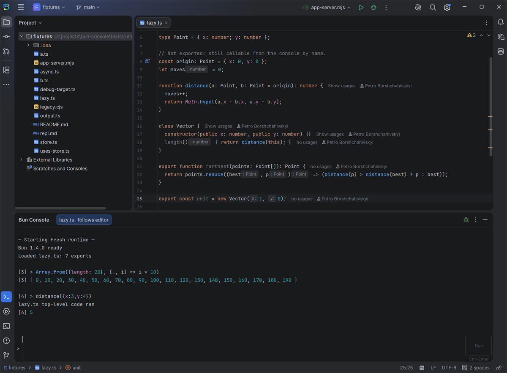
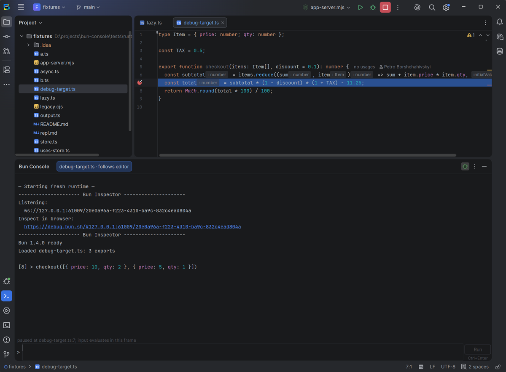
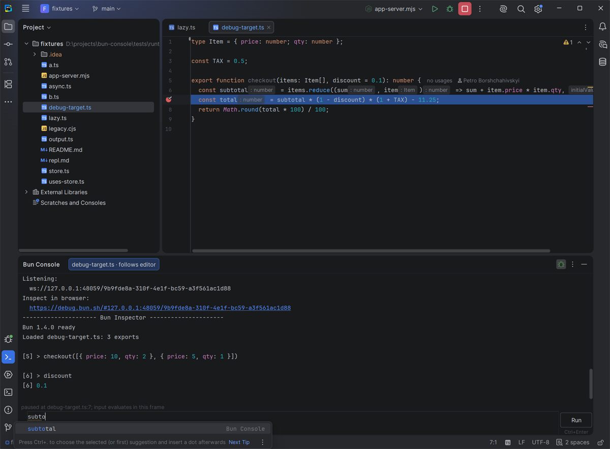

<p align="center">
  
</p>

<h1 align="center">Bun Console</h1>

<p align="center">
  An interactive JavaScript and TypeScript console for WebStorm, running on <a href="https://bun.sh">Bun</a>.<br>
  Call the functions of the file you are editing, try snippets, and debug them — without leaving the IDE.
</p>

<p align="center">
  <a href="https://plugins.jetbrains.com/plugin/34626-bun-console"></a>
  <a href="https://plugins.jetbrains.com/plugin/34626-bun-console"></a>
  <a href="LICENSE"></a>
</p>

<p align="center">
  
</p>

---

## Contents

- [Why](#why)
- [Requirements](#requirements)
- [Installation](#installation)
- [Quick start](#quick-start)
- [Running code](#running-code)
- [Your files as the console context](#your-files-as-the-console-context)
- [Imports](#imports)
- [Long-running code and errors](#long-running-code-and-errors)
- [Debugging](#debugging)
- [Settings](#settings)
- [Troubleshooting](#troubleshooting)
- [Limitations](#limitations)
- [How it works](#how-it-works)
- [Building from source](#building-from-source)
- [License](#license)

## Why

You wrote `parse()` in `parser.ts` and want to see what it returns for a few inputs.
Usually that means a scratch file, a test, or copying code into a browser console.
With Bun Console you open `parser.ts`, open the console and type `parse("abc")`.

- **Your code is already there.** Functions, classes, variables and enums of the file open
  in the editor are available by name — exported or not — without imports.
- **State stays.** Variables live between commands. `const`, `let` and `class` can be declared
  again, so you can keep refining the same line.
- **Nothing runs behind your back.** Switching editor tabs never executes code. A file runs
  only when the console first uses one of its names.
- **Debug from the console.** With the debugger on, breakpoints stop console calls. While any
  JavaScript program you debug in WebStorm is paused, the console evaluates in its stack frame.

If you have used the developer console of a browser, most of it will feel familiar.

## Requirements

| Component | Requirement |
| --- | --- |
| IDE | WebStorm 2026.2 or newer (other IntelliJ-based IDEs with the JavaScript and Bun plugins may work, but are not tested) |
| Runtime | [Bun](https://bun.sh/docs/installation) 1.4 or newer |
| Debugger (optional) | A Node.js interpreter configured in WebStorm — the bundled Bun debug adapter runs on Node.js |

## Installation

**From JetBrains Marketplace:** *Settings → Plugins → Marketplace*, search for **Bun Console**,
click *Install* — or use *Install to IDE* on the
[plugin page](https://plugins.jetbrains.com/plugin/34626-bun-console).

**From a file:** download `bun-console-<version>.zip` from the
[releases](https://github.com/Liksu/bun-console/releases), then *Settings → Plugins → ⚙ → Install
Plugin from Disk…* and select the zip. No IDE restart is needed.

Make sure Bun is installed:

```bash
bun --version
```

## Quick start

1. Open a JavaScript or TypeScript file of your project, for example:

   ```ts
   // parser.ts
   const separators = /[\s,;]+/;

   export function tokenize(text: string): string[] {
     return text.split(separators).filter(Boolean);
   }
   ```

2. Open the console: **View → Tool Windows → Bun Console**, or click its `>` button on the
   bottom tool-window bar.
3. Type an expression and press **Ctrl+Enter**:

   ```js
   tokenize("a, b;c")          // [ 'a', 'b', 'c' ]
   separators.source           // '[\\s,;]+'  — not exported, still available
   ```

The tab above the output shows which file is the context (`parser.ts · follows editor`).
Switch to another file in the editor and the console follows it.

## Running code

| Action | Keys |
| --- | --- |
| Run the input | **Ctrl+Enter** (or the **Run** button) |
| New line | **Enter** |
| Previous / next command | **Up** / **Down** on the first / last line, or **Alt+Up** / **Alt+Down** |
| Completion | as in the editor (**Ctrl+Space**) |

You can swap Enter and Ctrl+Enter in [Settings](#settings) (Enter runs, Shift+Enter adds a line).
The run shortcut can be changed in *Settings → Keymap → Run Bun Console Input*.

- **Results** are printed under the command with its number: `[3] > 1 + 1` → `[3] 2`.
  Values are printed **completely** — every array item, every nesting level, whole strings —
  on one line when they fit the console width, otherwise laid out for that width (long arrays of
  numbers or strings fill the whole width). (Only output
  longer than 5 million characters is cut, with a note, to keep the IDE responsive.)
- **Output** of `console.log`, `console.error`, `console.table` and `process.stdout.write`
  appears before the command's result, in order. Warnings are yellow and errors are red.
- **Declarations persist.** `const total = 42` stays available in later commands and appears in
  completion. Declaring `total` again replaces it, as in a browser console. Declaring the
  same name twice *in one command* is still an error.
- **Top-level `await`** works: `await fetch("https://example.com").then(r => r.status)`.
- **History** keeps the last 500 commands. A recalled command can be edited before running it.
  Moving down past the newest command brings back the text you were typing.
- **Clear Output** (⋮ menu) or `console.clear()` empties the transcript but keeps variables,
  history and input.
- **Restart Runtime** (⋮ menu) starts a fresh Bun process: variables are reset, the transcript,
  history and file contexts stay. Earlier commands are never replayed.

The console input is JavaScript. TypeScript files are loaded and debugged normally, but type
annotations typed into the console itself are not supported.

## Your files as the console context

### The file in the editor

The JS/TS file selected in the editor is the **context**: its top-level functions, classes,
variables and enums are available by name, whether they are exported or not. Names that are
already taken in the console (your own variables, globals like `process`) are left alone; the
transcript lists such collisions.

A context file is **not executed when you open it**. The console reads the file to learn its
names; the module's top-level code runs the first time a command uses one of those names — once,
like a normal import. The same applies to the files it imports.

If the whole module namespace is needed, it is available as `globalThis['parser.ts']`.

### Keeping more files: pin, Add File, Add Symbol

By default the console follows the editor: open another file and its names replace the previous
file's names. Three commands keep names around while you move through the project:

| Command | Where | What stays available |
| --- | --- | --- |
| **Pin File Context** | ⋮ menu of the console (a checkbox) | every top-level name of the *current* file |
| **Add File to Bun Console** | context menu of the editor or the Project tree | every top-level name of *any* JS/TS file, even one that is not open |
| **Add Symbol to Bun Console** | context menu of the editor, caret on a name | *one* top-level declaration |

**Tabs.** Each context file has a tab above the output: pinned and added files first
(`store.ts · pinned`), then the file following the editor (`parser.ts · follows editor`). Clicking a
tab opens that file in the editor. All tabs show one and the same console — the same input,
transcript and variables; the tabs only tell you which files' names are in scope.

**Unpin / remove.** Uncheck *Pin File Context* while that file is open, or use **Remove File from
Bun Console** in its context menu. Its names disappear; your own variables stay.

**Add Symbol** works with the caret on a declaration (`function tokenize`, `const separators`,
`class Parser`) or on any reference to one. It understands export lists such as
`export { tokenize as split }` and names a default export after its declaration. Top-level
declarations can be added whether they are exported or not; declarations nested inside functions
are only reachable while paused in a frame where they are in scope ([Debugging](#debugging)).

**Restart Runtime keeps all of it.** Pinned files, added files and added symbols come back in the
fresh runtime; only variables created by your commands are reset.

**Name clashes.** Your own variables and built-in globals (`process`, `console`, …) are never
replaced; the transcript lists names that were skipped. When two context files declare the same
name, the file following the editor keeps the short name and the other one gets an alias
(`shared_2`); the transcript says which. A default export of an added file is named after the file
(`parser_default` for `parser.ts`). Every context file is also reachable as a whole module:
`globalThis['parser.ts']`, or with the folder when file names repeat (`globalThis['left/shared.ts']`,
as on the tabs).

For example, to try a store together with the code that uses it:

```js
// store.ts is open — pin it (⋮ → Pin File Context), then open app.ts
add("apple")                 // from store.ts (pinned)
render()                     // from app.ts (follows the editor)
items                        // store.ts's non-exported array: [ 'apple' ]
globalThis['store.ts']       // the whole module
```

### Editing context files

Edit a context file and return to the console: it is saved and reloaded before your next command.
Your console variables survive. If you changed a file that a context file only *imports*, the
status line asks for **Restart Runtime** (the ↻ button in the title bar), because the old version
is still in use by the modules that imported it.

### Non-exported names and CommonJS

Non-exported declarations become available by adding an `export { … }` list after the module's
last line when Bun loads it; line numbers, stack traces and breakpoints are unaffected. This is
also prepared for the files a context file imports, so their names are available when you open
them later. If a file was loaded some other way before the console knew about it (for example
through a dynamic `import()`), reading one of its non-exported names says that it needs
**Restart Runtime**.

CommonJS files (`module.exports = …`) cannot be extended that way: names listed in
`module.exports` work, and reading any other top-level name explains why it is unavailable.

## Imports

Static `import` statements work in the console, in all forms:

```js
import path from 'path'
import { join as combine } from 'node:path'
import * as fs from 'node:fs'
import './setup'
import { tokenize } from './parser'     // relative to the context file
path.basename(combine('a', 'b.txt'))
```

Imported names stay available until Restart Runtime. Relative paths resolve from the context
file, or from the project folder when there is none; packages and built-in modules resolve as
Bun resolves them. Importing a name that is already taken asks for an alias. Import attributes
(`with { type: 'json' }`) are not supported yet; dynamic `import()` works as usual.

Completion in the console offers what the running console actually has: context file names,
your variables and imports. It does not offer other project exports, because accepting one would
add an `import` line to the input.

## Long-running code and errors

- **Pending promises don't block the console.** `await sleep(5000)` keeps running while you type
  and run other commands; its result is printed under its own number when it arrives.
- **Status line.** After 100 ms the line above the input shows `running… 3 s`.
- **Busy JavaScript.** If synchronous code keeps Bun's thread busy (`while (true) {}`), the status
  line says so within a couple of seconds and the ↻ **Restart Runtime** button appears — the only way
  to stop such code, as in a browser tab.
- **Errors are never fatal.** An error thrown by your command is printed under it. Errors nobody
  catches — a rejected promise nobody awaits, an exception in a timer — are printed as
  `Uncaught …` / `Uncaught (in promise) …`, and the runtime keeps all its state.
- **Processes started from the console** (`Bun.spawn`, child servers) are ended by Restart Runtime
  and when the project closes.
- Console code and your modules share one global object, so values pass between them unchanged:
  `instanceof Array`, your classes and `globalThis` properties work across both.

## Debugging

### Breakpoints in console calls

Turn the debugger on with the **bug button** in the console's title bar (or ⋮ → *Debugger*).
The runtime restarts with WebStorm's Bun debugger attached; the transcript, history and file
contexts stay.

Set a breakpoint in a context file and call the function from the console. Execution stops at
the breakpoint and the **Debug** window shows the stack and variables. The status line reads
`paused at parser.ts:14; input evaluates in this frame`, and:

- anything you type in the console is evaluated **in the selected stack frame** — locals,
  arguments and closures included;
- completion offers the names in scope at that point;
- **Continue**, **Step Over**, **Step Into** and **Step Out** are in the ⋮ menu (and in the Debug
  window). When the call finishes, its result is printed under its original command number.

<p align="center">
  
</p>
<p align="center">
  
</p>

Turn the debugger off with the same button when you don't need it. If you edit a file that has breakpoints, the console restarts its runtime before the
next command so the breakpoints stay attached to the new code.

### Your own program paused in WebStorm

This works with the console's debugger off. Start your own Node.js or Bun program with
WebStorm's regular **Debug**, stop it at a breakpoint and open Bun Console: the status line shows
`paused in <session> at file:line`, and console input is evaluated in that program's selected
frame. Continue from the ⋮ menu or the Debug window; afterwards input goes back to the console's
own runtime.

## Settings

*Settings → Tools → Bun Console*:

- **Bun executable.** By default Bun is found automatically: the IDE's `PATH` (on macOS
  including your login shell's `PATH`), then `$BUN_INSTALL/bin`, `~/.bun/bin`, and Homebrew or
  `/usr/local` locations. Clear *Find Bun automatically* to choose a file. The setting applies to
  all projects on this computer and takes effect at the next Restart Runtime.
- **Start console with debugger.** The same switch as the bug button.
- **Console input keys.** *Enter: new line; Ctrl+Enter: run* (default) or *Enter: run;
  Shift+Enter: new line*. Takes effect immediately.

## Troubleshooting

**"Bun was not found."** Install Bun 1.4+ or choose its executable in the settings. On macOS,
an IDE started from the Dock sees your shell's `PATH` only if the shell profile exports it.

**"Bun Console requires Bun 1.4 or newer."** Run `bun upgrade`.

**The debugger does not attach.** The Bun debug adapter needs a Node.js interpreter: set one in
*Settings → Languages & Frameworks → Node.js*. If attaching still fails, the console reports it
and continues without the debugger; switch the debugger off and on to retry.

**A name "is not available … Restart Runtime".** The file was loaded before the console could
expose its non-exported names (see [above](#non-exported-names-and-commonjs)). Restart Runtime.

**The status line asks to Restart Runtime after an edit.** A file imported by your context file
changed; the modules that use it still hold the old version. Restart to load the new code.

**The console is stuck on `JavaScript is busy`.** Synchronous code is still running. Click ↻
Restart Runtime.

## Limitations

- Type annotations are not supported in the console input (context files may be TypeScript).
- Import attributes (`import … with { … }`) are not supported yet.
- The runtime is Bun only; there is no Node.js runtime for the console itself.
- The debugger integration uses WebStorm's DAP facade, which JetBrains marks as experimental. If a
  future IDE version changes it, the console keeps working without the debugger until an update.

## How it works

The plugin starts a Bun process with a small bootstrap script stored in the IDE's system folder
(nothing is written to your project) and talks to it over a local socket protected by a one-time
token. Console input is prepared in the IDE with WebStorm's JavaScript parser (import statements
and repeated declarations are rewritten so that they work in a REPL) and evaluated with Bun's
`node:repl` in the process's global scope. File contexts are read with Bun's transpiler to learn
their exports without running them; modules run through Bun's normal module loader on first use.
The debugger is WebStorm's own Bun debugger attached to the console's process, and paused-frame
evaluation uses the IDE's debugger API.

## Building from source

See [docs/development.md](docs/development.md) for building, testing, running a sandbox IDE and
the release checklist.

## License

[MIT](LICENSE) © Petro Borshchahivskyi
